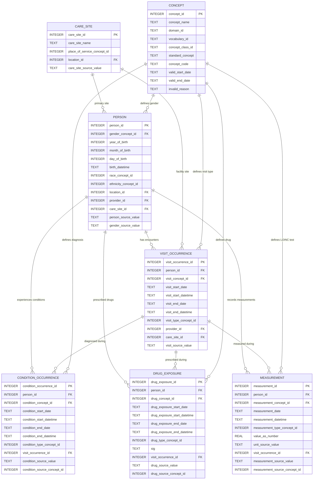

# OMOP CDM v5.4 Relational Database Schema Documentation

This document provides a detailed technical reference for the target relational schema implemented in **Step 2 (FHIR-to-OMOP ETL)**. The database is stored locally as an SQLite file at [`step_2_fhir_to_omop/data/omop_cdm.db`](file:///Users/ahmadhidayat/claude-code/projects/FHIR-to-OMOP/step_2_fhir_to_omop/data/omop_cdm.db).

---

## 1. Schema Entity-Relationship (ER) Model

The database represents a patient-centric star schema conforming to the **OHDSI OMOP Common Data Model v5.4** standard. Clinical event tables map back to the core `PERSON` table via foreign keys.



---

## 2. Table Specifications & Columns

### 2.1 Core Clinical Registry Tables

#### Table: `person`
Stores demographic baseline information for each simulated patient.

| Column Name | SQLite Type | Constraint | Description / Mapping Rule |
| :--- | :--- | :--- | :--- |
| `person_id` | `INTEGER` | `PRIMARY KEY AUTOINCREMENT` | Unique clinical surrogate key identifier. |
| `gender_concept_id` | `INTEGER` | `NOT NULL` | Standard Concept ID for gender (e.g. `8507` = Male, `8532` = Female). |
| `year_of_birth` | `INTEGER` | `NOT NULL` | Year extracted from `Patient.birthDate`. |
| `month_of_birth` | `INTEGER` | `NULL` | Month extracted from `Patient.birthDate`. |
| `day_of_birth` | `INTEGER` | `NULL` | Day extracted from `Patient.birthDate`. |
| `birth_datetime` | `TEXT` | `NULL` | Complete birth date string (`YYYY-MM-DD`). |
| `race_concept_id` | `INTEGER` | `NOT NULL` | Defaulted to `0` (No matching concept). |
| `ethnicity_concept_id` | `INTEGER` | `NOT NULL` | Defaulted to `0` (No matching concept). |
| `location_id` | `INTEGER` | `NULL` | Reference to patient home address registry (nullable). |
| `provider_id` | `INTEGER` | `NULL` | Primary healthcare provider (nullable). |
| `care_site_id` | `INTEGER` | `NULL` | Reference to care site (`10000004` = RSUD Tarakan Jakarta). |
| `person_source_value` | `TEXT` | `NULL` | **De-identified Tokenized NIK** (`tok_be0a61effae63bba`). |
| `gender_source_value` | `TEXT` | `NULL` | Raw gender value string from FHIR (`male`/`female`). |

#### Table: `visit_occurrence`
Stores encounter details mapped from HL7 FHIR `Encounter` resources.

| Column Name | SQLite Type | Constraint | Description / Mapping Rule |
| :--- | :--- | :--- | :--- |
| `visit_occurrence_id` | `INTEGER` | `PRIMARY KEY AUTOINCREMENT` | Unique visit record key. |
| `person_id` | `INTEGER` | `NOT NULL` | Links to `person.person_id` (Foreign Key). |
| `visit_concept_id` | `INTEGER` | `NOT NULL` | Standard OMOP concept (e.g., `9202` = Outpatient, `9201` = Inpatient). |
| `visit_start_date` | `TEXT` | `NOT NULL` | Start date format `YYYY-MM-DD`. |
| `visit_start_datetime`| `TEXT` | `NULL` | ISO 8601 start timestamp. |
| `visit_end_date` | `TEXT` | `NOT NULL` | End date format `YYYY-MM-DD`. |
| `visit_end_datetime` | `TEXT` | `NULL` | ISO 8601 end timestamp. |
| `visit_type_concept_id`| `INTEGER` | `NOT NULL` | Standard OMOP provenance metadata ID (`44818518` = EHR Record). |
| `provider_id` | `INTEGER` | `NULL` | Attending practitioner (nullable). |
| `care_site_id` | `INTEGER` | `NULL` | Facility ID (`10000004` = RSUD Tarakan Jakarta). |
| `visit_source_value` | `TEXT` | `NULL` | Raw `Encounter.id` UUID from FHIR. |

#### Table: `condition_occurrence`
Stores patient clinical diagnosis codes mapped from FHIR `Condition` resources.

| Column Name | SQLite Type | Constraint | Description / Mapping Rule |
| :--- | :--- | :--- | :--- |
| `condition_occurrence_id`|`INTEGER` | `PRIMARY KEY AUTOINCREMENT` | Unique diagnosis event key. |
| `person_id` | `INTEGER` | `NOT NULL` | Links to `person.person_id` (Foreign Key). |
| `condition_concept_id` | `INTEGER` | `NOT NULL` | **Standard Concept ID** mapped from SNOMED (e.g. `201820`). |
| `condition_start_date` | `TEXT` | `NOT NULL` | Diagnosis onset date format `YYYY-MM-DD`. |
| `condition_start_datetime`|`TEXT` | `NULL` | ISO 8601 diagnosis onset timestamp. |
| `condition_end_date` | `TEXT` | `NULL` | Diagnosis resolution date format `YYYY-MM-DD`. |
| `condition_end_datetime`| `TEXT` | `NULL` | ISO 8601 resolution timestamp. |
| `condition_type_concept_id`|`INTEGER` | `NOT NULL` | Standard provenance concept ID (`32817` = EHR Encounter Record). |
| `visit_occurrence_id` | `INTEGER` | `NULL` | Link to encounter where diagnosis was made (Foreign Key). |
| `condition_source_value`| `TEXT` | `NULL` | Raw SNOMED CT term text display (e.g., "Type 2 diabetes"). |
| `condition_source_concept_id`|`INTEGER`| `NULL` | Raw SNOMED CT numeric code identifier (e.g. `44054006`). |

#### Table: `drug_exposure`
Stores prescription records mapped from FHIR `MedicationRequest` resources.

| Column Name | SQLite Type | Constraint | Description / Mapping Rule |
| :--- | :--- | :--- | :--- |
| `drug_exposure_id` | `INTEGER` | `PRIMARY KEY AUTOINCREMENT` | Unique drug prescription event key. |
| `person_id` | `INTEGER` | `NOT NULL` | Links to `person.person_id` (Foreign Key). |
| `drug_concept_id` | `INTEGER` | `NOT NULL` | **Standard Concept ID** mapped from RxNorm (e.g. `1529331`). |
| `drug_exposure_start_date`|`TEXT` | `NOT NULL` | Date of prescription format `YYYY-MM-DD`. |
| `drug_exposure_start_datetime`|`TEXT` | `NULL` | ISO 8601 prescription timestamp. |
| `drug_exposure_end_date` | `TEXT` | `NULL` | Defaulted to prescription date format `YYYY-MM-DD`. |
| `drug_exposure_end_datetime`|`TEXT` | `NULL` | Defaulted to prescription timestamp. |
| `drug_type_concept_id` | `INTEGER` | `NOT NULL` | Standard provenance concept ID (`32817` = EHR Encounter Record). |
| `sig` | `TEXT` | `NULL` | Raw textual dosing instructions (e.g., "Once daily"). |
| `visit_occurrence_id` | `INTEGER` | `NULL` | Link to encounter where drug was written (Foreign Key). |
| `drug_source_value` | `TEXT` | `NULL` | Raw RxNorm brand/display name. |
| `drug_source_concept_id`|`INTEGER` | `NULL` | Raw RxNorm numeric code identifier (e.g. `860975`). |

#### Table: `measurement`
Stores vital signs and lab results mapped from FHIR `Observation` resources.

| Column Name | SQLite Type | Constraint | Description / Mapping Rule |
| :--- | :--- | :--- | :--- |
| `measurement_id` | `INTEGER` | `PRIMARY KEY AUTOINCREMENT` | Unique clinical measurement event key. |
| `person_id` | `INTEGER` | `NOT NULL` | Links to `person.person_id` (Foreign Key). |
| `measurement_concept_id`| `INTEGER` | `NOT NULL` | **Standard Concept ID** mapped from LOINC (e.g. `3004249`). |
| `measurement_date` | `TEXT` | `NOT NULL` | Date of assessment format `YYYY-MM-DD`. |
| `measurement_datetime` | `TEXT` | `NULL` | ISO 8601 assessment timestamp. |
| `measurement_type_concept_id`|`INTEGER`| `NOT NULL` | Standard provenance concept ID (`32817` = EHR Encounter Record). |
| `value_as_number` | `REAL` | `NULL` | Numeric outcome value (e.g., `120.0`). |
| `unit_source_value` | `TEXT` | `NULL` | Raw text unit code (e.g., `mm[Hg]`, `kg`, `cm`). |
| `visit_occurrence_id` | `INTEGER` | `NULL` | Link to encounter where test was run (Foreign Key). |
| `measurement_source_value`| `TEXT` | `NULL` | Raw LOINC name string (e.g. "Systolic Blood Pressure"). |
| `measurement_source_concept_id`|`INTEGER`| `NULL` | Raw LOINC code representation (e.g. `84806`). |

---

### 2.2 Metadata & Standard Terminology Tables

#### Table: `concept`
Preloaded repository containing terminology lookups and mappings.

| Column Name | SQLite Type | Constraint | Description |
| :--- | :--- | :--- | :--- |
| `concept_id` | `INTEGER` | `PRIMARY KEY` | Standard OHDSI concept lookup ID. |
| `concept_name` | `TEXT` | `NOT NULL` | Name description (e.g., "Ambulatory"). |
| `domain_id` | `TEXT` | `NOT NULL` | Domain classification (e.g. `Gender`, `Visit`, `Condition`, `Drug`). |
| `vocabulary_id` | `TEXT` | `NOT NULL` | Terminology vocabulary code (e.g. `SNOMED`, `RxNorm`, `LOINC`). |
| `concept_class_id` | `TEXT` | `NOT NULL` | Structural classification. |
| `standard_concept` | `TEXT` | `NULL` | Standard indicator flag (`S` = Standard, `NULL` = Source). |
| `concept_code` | `TEXT` | `NOT NULL` | Underlying vocabulary code string (e.g. `44054006`). |
| `valid_start_date` | `TEXT` | `NOT NULL` | Date concept became active (`1970-01-01`). |
| `valid_end_date` | `TEXT` | `NOT NULL` | Date concept expires (`2099-12-31`). |
| `invalid_reason` | `TEXT` | `NULL` | Description of retirement if active concept is revoked. |

#### Table: `care_site`
Defines clinical sites where healthcare is delivered.

| Column Name | SQLite Type | Constraint | Description |
| :--- | :--- | :--- | :--- |
| `care_site_id` | `INTEGER` | `PRIMARY KEY AUTOINCREMENT` | Facility surrogate key (`10000004` used for this ETL). |
| `care_site_name` | `TEXT` | `NULL` | Facility Name ("RSUD Tarakan Jakarta"). |
| `place_of_service_concept_id`|`INTEGER`| `NULL` | Standard classification concept (`9202` = Outpatient). |
| `location_id` | `INTEGER` | `NULL` | Link to location address table. |
| `care_site_source_value` | `TEXT` | `NULL` | String representation of facility ID. |

---

## 3. Vocabulary Alignment Mapping Matrix

This reference table outlines the standard vocabulary codes loaded into the database:

| Domain | Source Code System | Source Code | Source Display Name | Target Concept ID | OMOP Standard Name |
| :--- | :--- | :--- | :--- | :--- | :--- |
| **Gender** | Administrative | `male` | male | **8507** | MALE |
| **Gender** | Administrative | `female` | female | **8532** | FEMALE |
| **Visit** | Encounter Class | `ambulatory` | ambulatory | **9202** | Outpatient Visit |
| **Visit** | Encounter Class | `emergency` | emergency | **9203** | Emergency Room Visit |
| **Visit** | Encounter Class | `inpatient` | inpatient | **9201** | Inpatient Visit |
| **Visit** | Encounter Class | `telehealth` | telehealth | **581477** | Telehealth Visit |
| **Condition** | SNOMED-CT | `44054006` | Type 2 diabetes mellitus | **201820** | Diabetes mellitus type 2 |
| **Condition** | SNOMED-CT | `38341003` | Hypertensive disorder | **316866** | Hypertensive disorder |
| **Condition** | SNOMED-CT | `195967001` | Asthma | **317009** | Asthma |
| **Condition** | SNOMED-CT | `56265001` | Urinary tract infection | **920355** | Urinary tract infection |
| **Condition** | SNOMED-CT | `86406008` | Human immunodeficiency virus | **432158** | Infection by Human immunodeficiency virus |
| **Condition** | SNOMED-CT | `236403004` | Microalbuminuria | **4147775** | Microalbuminuria |
| **Drug** | RxNorm | `860975` | Metformin 500mg ER | **1529331** | Metformin hydrochloride 500 MG ER |
| **Drug** | RxNorm | `865091` | Insulin Isophane | **1398937** | insulin isophane, human 70 UNT/ML |
| **Measurement** | LOINC | `8480-6` | Systolic Blood Pressure | **3004249** | Systolic blood pressure |
| **Measurement** | LOINC | `8462-4` | Diastolic Blood Pressure | **3004279** | Diastolic blood pressure |

---

## 4. De-identification Security Audit Trail

To ensure compliance with **Indonesian Personal Data Protection Law (UU PDP No. 27/2022)**, direct PII attributes are tokenized at ingestion.

> [!IMPORTANT]
> - **Hashing Algorithm:** SHA-256
> - **Formatting Rule:** `tok_<sha256_hex_prefix_16_chars>`
> - **Applicability:** Applied to the citizen national registration number (`NIK`) from `Patient.identifier`.
> - **Location in Database:** Mapped exclusively to `person.person_source_value`.

```
[FHIR Input: NIK "3174092108760002"] 
        │
        ▼ (ETL Tokenization Process)
[SHA-256 Hash: be0a61effae63bbaef19...] 
        │
        ▼ (Prefix Extraction)
[OMOP Person Table: person_source_value = "tok_be0a61effae63bba"]
```

---

## 5. Sample Verification SQL Query

This OHDSI-compliant SQL query pulls the adult cohort matching the **EXPLORE study** criteria (Adults $\ge 18$ diagnosed with Type 2 Diabetes, prescribed either Metformin ER or Insulin Isophane at RSUD Tarakan Jakarta):

```sql
SELECT DISTINCT
    p.person_id AS omop_id,
    p.person_source_value AS deidentified_nik_token,
    (2026 - p.year_of_birth) AS current_calculated_age,
    c_gender.concept_name AS patient_gender,
    c_cond.concept_name AS diagnosis,
    c_drug.concept_name AS study_medication,
    de.drug_exposure_start_date AS date_prescribed
FROM person p
JOIN concept c_gender 
  ON p.gender_concept_id = c_gender.concept_id
JOIN condition_occurrence co 
  ON p.person_id = co.person_id
JOIN concept c_cond 
  ON co.condition_concept_id = c_cond.concept_id
JOIN drug_exposure de 
  ON p.person_id = de.person_id
JOIN concept c_drug 
  ON de.drug_concept_id = c_drug.concept_id
WHERE (2026 - p.year_of_birth) >= 18
  AND co.condition_concept_id = 201820  -- Diabetes mellitus type 2
  AND de.drug_concept_id IN (1529331, 1398937) -- Metformin ER or Insulin Isophane
ORDER BY current_calculated_age DESC;
```
