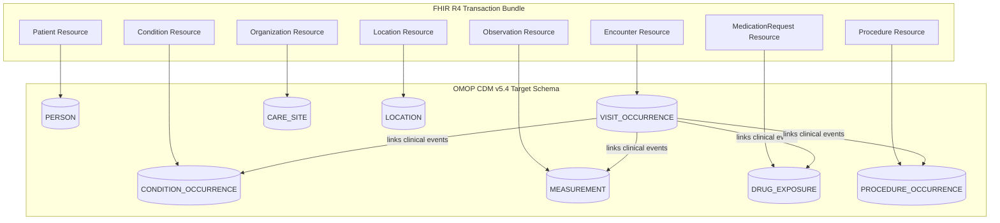

# Data Transformation Plan: HL7 FHIR R4 to OMOP CDM v5.4

This document defines the ETL (Extract, Transform, Load) specifications for mapping the generated Kemenkes SATUSEHAT FHIR R4 patient bundle files into the **OMOP Common Data Model (CDM) v5.4** database schema.

---

## 1. Conceptual Architecture

The transformation maps clinical transaction-based data (FHIR) into a patient-centric relational model (OMOP) designed for research analytics.



---

## 2. Resource-to-Table Mapping Specifications

### 2.1 Patient $\rightarrow$ PERSON
Maps demographic data, NIK identifiers, and gender attributes.

| FHIR Path | OMOP Table | OMOP Column | Standard Target Concept / Logic |
| :--- | :--- | :--- | :--- |
| `Patient.id` | `PERSON` | `person_source_value` | Raw string UUID |
| `Patient.gender` | `PERSON` | `gender_concept_id` | `male` $\rightarrow$ **8507** (MALE)<br>`female` $\rightarrow$ **8532** (FEMALE) |
| `Patient.birthDate` | `PERSON` | `year_of_birth`<br>`month_of_birth`<br>`day_of_birth` | Extracted from `YYYY-MM-DD` |
| `Patient.birthDate` | `PERSON` | `birth_datetime` | Cast to ISO 8601 Datetime |
| `Patient.identifier[system=".../nik"]` | `PERSON` | `person_source_value` | Tokenized NIK string (SHA-256 irreversible token for PII blinding) |
| `Patient.identifier[system=".../ihs-number"]` | `PERSON` | `person_source_value` | Fallback or secondary tokenized identifier |

> [!NOTE]
> Ethnicity and Race columns (`race_concept_id`, `ethnicity_concept_id`) will be mapped to standard concept **0** (No matching concept) or a custom Indonesian concept profile if local sub-population analyses are required.

---

### 2.2 Encounter $\rightarrow$ VISIT_OCCURRENCE
Maps clinic visits, telehealth encounters, and hospital admissions.

| FHIR Path | OMOP Table | OMOP Column | Standard Target Concept / Logic |
| :--- | :--- | :--- | :--- |
| `Encounter.id` | `VISIT_OCCURRENCE` | `visit_source_value` | Raw string UUID |
| `Encounter.class.code` | `VISIT_OCCURRENCE` | `visit_concept_id` | `AMB` (ambulatory) $\rightarrow$ **9202** (Outpatient)<br>`EMER` (emergency) $\rightarrow$ **9203** (Emergency)<br>`IMP` (inpatient) $\rightarrow$ **9201** (Inpatient)<br>`telehealth` $\rightarrow$ **581477** (Telehealth) |
| `Encounter.period.start` | `VISIT_OCCURRENCE` | `visit_start_date` | Date format `YYYY-MM-DD` |
| `Encounter.period.start` | `VISIT_OCCURRENCE` | `visit_start_datetime` | Datetime format |
| `Encounter.period.end` | `VISIT_OCCURRENCE` | `visit_end_date` | Date format `YYYY-MM-DD` |
| `Encounter.period.end` | `VISIT_OCCURRENCE` | `visit_end_datetime` | Datetime format |

---

### 2.3 Condition $\rightarrow$ CONDITION_OCCURRENCE
Maps clinical diagnoses (non-communicable and communicable profiles).

| FHIR Path | OMOP Table | OMOP Column | Standard Target Concept / Logic |
| :--- | :--- | :--- | :--- |
| `Condition.id` | `CONDITION_OCCURRENCE` | `condition_source_value` | Raw string UUID |
| `Condition.code.coding[0].code` | `CONDITION_OCCURRENCE` | `condition_source_concept_id` | SNOMED CT concept identifier |
| `Condition.code.coding[0].code` | `CONDITION_OCCURRENCE` | `condition_concept_id` | **Standard Target Concept ID** via OMOP Vocabulary mapping (e.g., SNOMED `44054006` $\rightarrow$ Standard Concept **201820** for Type 2 Diabetes) |
| `Condition.onsetDateTime` | `CONDITION_OCCURRENCE` | `condition_start_date` / `_datetime` | Start of clinical episode |
| `Condition.abatementDateTime` | `CONDITION_OCCURRENCE` | `condition_end_date` / `_datetime` | Resolution date (nullable) |
| `Condition.subject.reference` | `CONDITION_OCCURRENCE` | `person_id` | Foreign key linking to `PERSON.person_id` |
| `Condition.encounter.reference` | `CONDITION_OCCURRENCE` | `visit_occurrence_id` | Foreign key linking to `VISIT_OCCURRENCE` |

---

### 2.4 MedicationRequest $\rightarrow$ DRUG_EXPOSURE
Maps prescriptions, drug routes, dosages, and active treatment stages.

| FHIR Path | OMOP Table | OMOP Column | Standard Target Concept / Logic |
| :--- | :--- | :--- | :--- |
| `MedicationRequest.id` | `DRUG_EXPOSURE` | `drug_source_value` | Raw string UUID |
| `MedicationRequest.medicationCodeableConcept.coding[0].code` | `DRUG_EXPOSURE` | `drug_source_concept_id` | RxNorm code identifier |
| `MedicationRequest.medicationCodeableConcept.coding[0].code` | `DRUG_EXPOSURE` | `drug_concept_id` | **Standard Target Drug Concept ID** via RxNorm to OMOP mapping (e.g. RxNorm `860975` $\rightarrow$ Standard Concept **1529331** for Metformin 500mg ER) |
| `MedicationRequest.authoredOn` | `DRUG_EXPOSURE` | `drug_exposure_start_date` | Date of prescription |
| `MedicationRequest.dosageInstruction[0].text` | `DRUG_EXPOSURE` | `sig` | Textual dosage instructions (e.g. "Take once daily") |
| `MedicationRequest.dosageInstruction[0].doseAndRate[0].doseQuantity.value` | `DRUG_EXPOSURE` | `quantity` | Count of drug units prescribed |

---

### 2.5 Observation $\rightarrow$ MEASUREMENT
Maps blood pressure readings, laboratory panels, and height/weight vitals.

| FHIR Path | OMOP Table | OMOP Column | Standard Target Concept / Logic |
| :--- | :--- | :--- | :--- |
| `Observation.id` | `MEASUREMENT` | `measurement_source_value` | Raw string UUID |
| `Observation.code.coding[0].code` | `MEASUREMENT` | `measurement_source_concept_id` | LOINC code identifier |
| `Observation.code.coding[0].code` | `MEASUREMENT` | `measurement_concept_id` | **Standard Target Measurement Concept ID** (e.g. LOINC `8480-6` $\rightarrow$ Standard Concept **3004249** for Systolic BP) |
| `Observation.valueQuantity.value` | `MEASUREMENT` | `value_as_number` | Numeric value (e.g. `120.0`) |
| `Observation.valueQuantity.unit` | `MEASUREMENT` | `unit_source_value` | Unit text (e.g. `mm[Hg]`) |
| `Observation.effectiveDateTime` | `MEASUREMENT` | `measurement_date` / `_datetime` | Clinical measurement date |

---

## 3. Vocabulary Alignment Mapping (Key Clinical Concepts)

A critical phase of the FHIR-to-OMOP ETL is resolving source terminology (SNOMED, LOINC, RxNorm) to standardized **OMOP Concept IDs**. Below is a reference map for the main disease cohorts simulated in `jakarta_hospital`:

| Source Code Type | Source Code | Source Display | Target OMOP Concept ID | OMOP Standard Concept Name |
| :--- | :--- | :--- | :--- | :--- |
| **SNOMED** | `44054006` | Type 2 diabetes mellitus | **201820** | Diabetes mellitus type 2 |
| **SNOMED** | `38341003` | Hypertensive disorder | **316866** | Hypertensive disorder |
| **SNOMED** | `195967001` | Asthma | **317009** | Asthma |
| **SNOMED** | `56265001` | Urinary tract infection | **920355** | Urinary tract infection |
| **SNOMED** | `86406008` | Human immunodeficiency virus | **432158** | Infection by Human immunodeficiency virus |
| **RxNorm** | `860975` | Metformin 500mg ER | **1529331** | Metformin hydrochloride 500 MG Extended Release Oral Tablet |
| **RxNorm** | `865091` | Insulin Isophane | **1398937** | insulin isophane, human 70 UNT/ML |
| **LOINC** | `8480-6` | Systolic Blood Pressure | **3004249** | Systolic blood pressure |
| **LOINC** | `8462-4` | Diastolic Blood Pressure | **3004279** | Diastolic blood pressure |

---

## 4. Step-by-Step Implementation Roadmap

```
Phase 1: Environment & Setup ──> Phase 2: Schema DDL ──> Phase 3: Vocabulary Load ──> Phase 4: Python ETL Script ──> Phase 5: Data Quality Verification
```

### Phase 1: Environment & Schema DDL Setup
1. Instantiate the target relational database (SQLite local file `data/omop_cdm.db`).
2. Execute the OMOP DDL script `scripts/initialize_omop_db.py` to construct the empty target schema (tables `PERSON`, `VISIT_OCCURRENCE`, etc.).

### Phase 2: Standard Vocabulary Ingestion
1. Populate vocabulary tables (`CONCEPT`, `VOCABULARY`). Key reference concepts are preloaded directly by the ETL pipeline.

### Phase 3: Python ETL Script Implementation
1. Construct the Python ETL script under `scripts/fhir_to_omop.py`.
2. The script will:
   * Scan `../step_1_fhir_creation/data/fhir/jakarta_hospital/` to read the SATUSEHAT transaction bundles.
   * Parse patient resources, extract dates, code elements, and measurements.
   * Map source terminology to standardized concept IDs.
   * Write SQL `INSERT` statements to populate the SQLite relational database.

### Phase 4: Data Quality Verification
1. Run `scripts/query_explore_cohort.py` to extract patients matching the EXPLORE study cohort criteria (T2DM adults on treatment) using standard OHDSI SQL queries.
